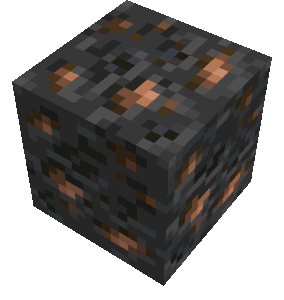

Steel is a new element and can be crafted with coke and raw iron ore in a blast furnace.
It is classified between Iron and Diamond with the following stats:

|                       | Iron   | Steel | Diamond |
| --------------------- | ------ | ----- | ------- |
| Attack Damage Bonus   | 2.0F   | 2.5F  | 3.0F    |
| Speed                 | 6.0F   | 7.0F  | 8.0F    |
| Uses                  | 250    | 500   | 1561    |
| Destroy Time          | _5.0F_ | 5.0F  | _5.0F_  |
| Explosion Resistance  | _6.0F_ | 6.0F  | _6.0F_  |
| Durability Multiplier | _15_   | 20    | _33_    |
| Enchantment Value     | _9_    | 9     | _10_    |
| Toughness             | _0.0F_ | 1.0F  | _2.0F_  |
| Knockback Resistance  | _0.0F_ | 0.0F  | _0.0F_  |
| Protection - Slot 0   | _2_    | 2     | _3_     |
| Protection - Slot 1   | _5_    | 5     | _6_     |
| Protection - Slot 2   | _6_    | 7     | _8_     |
| Protection - Slot 3   | _2_    | 2     | _3_     |
